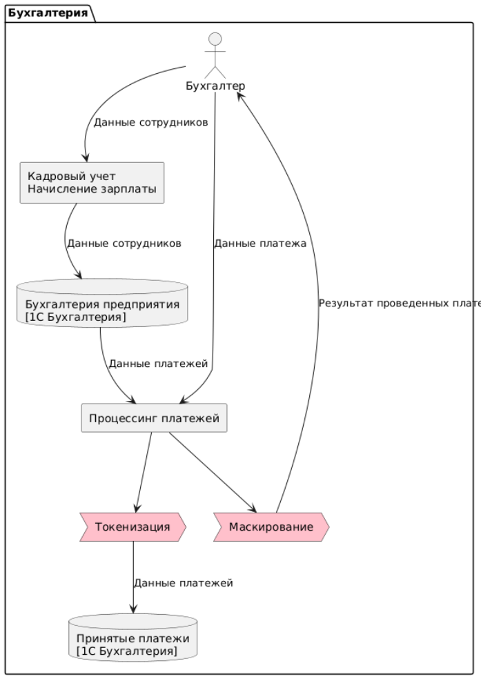
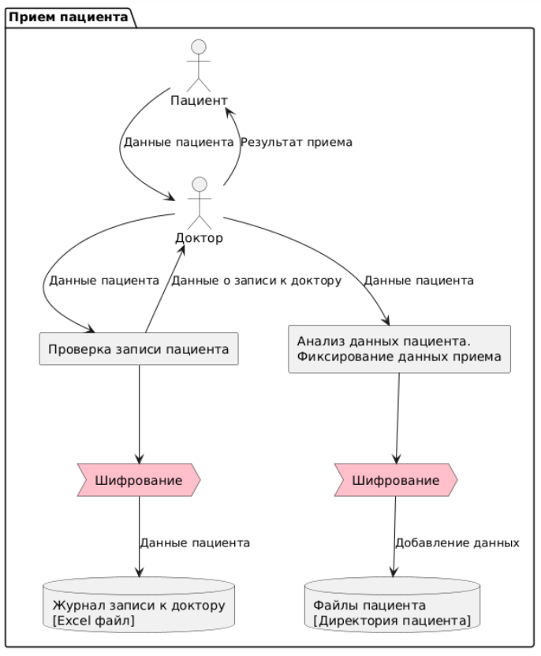
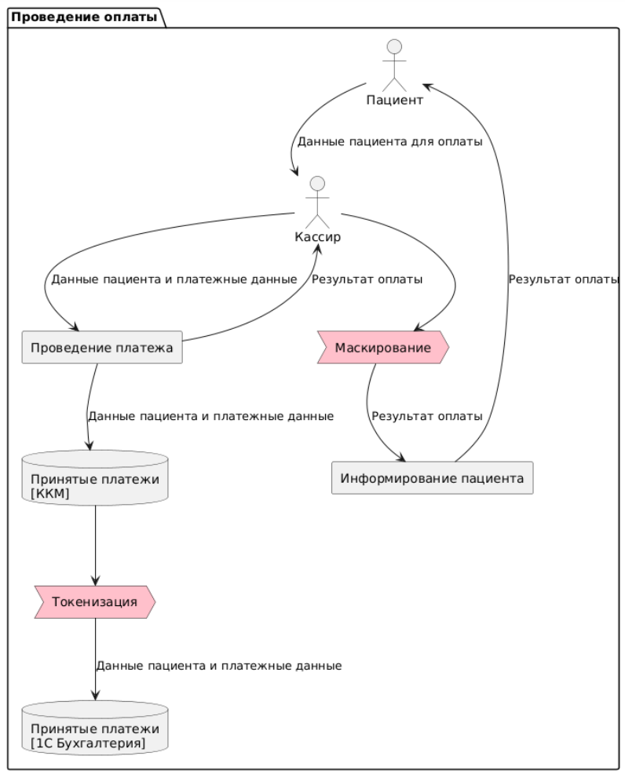
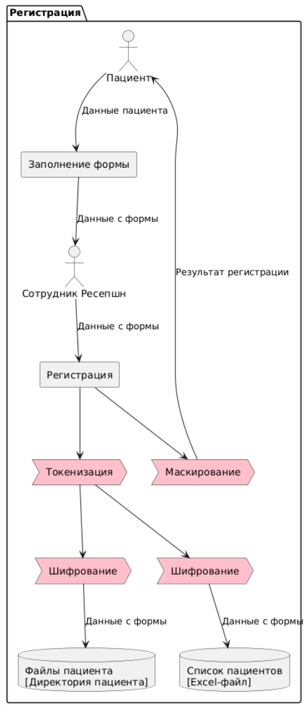
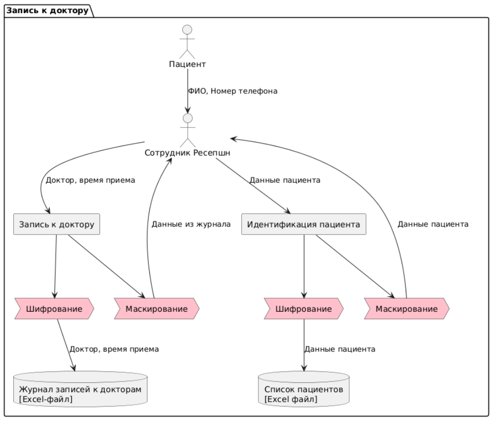

# Выявление конфиденциальных данных, которые не учтены во внутренних системах

## Диаграммы потоков данных (Data Flow Diagrams)

[Редактирование](https://www.plantuml.com/plantuml/uml/lLXTJoDL6BxlhpZ1Mp6n52-yC9ku-YTSqWpJWOvjPvhEa4YC2MLtNHCsGHEZXkowQhZmiaAx54hBNpZpZtoUdAazSywXJ84O4gQdVP_dlD_lspv9Kg-NxdNQukcNJokLIjVpMzvk8DRa7t8ap-KuwsU7sO4SPD_ZzV6Q-BOYXEUdSGyYxzJR49ncXsl2IqJNIyCWIY7J2_pKYtRRfFfL3kIDdCc9d5AM296za3FmNcT718gTkDUfxuJjTXZj0jtmKc_RImZ-4r1e0VYLm4ljHhnrzYpwwejl_A2z3hw1l9IJBQ4hajGRsmk5mJMZDTbpEQGQOAIP81_9c-m7EIMKcWVTD8oZC34DSVfaeN-t5_j1abWcd2hLiYFJW07Kbp-3v01lND4Yl0Ab9RUb6rNVYTkDe8SxyWjnnT-0lG0OBf43vM85IPgRueDk6BNAYd_Y47y3RVho2Y0RqabQ6mx8NmnO7ksBWglILhG04AEi4klhdnNIG7mgu1jUDSsEvCZo2Q05SUBrs9duhAyb7S2wBC5c3E_2c-Aae6qLeKpacVx4cG-UzRHSIczmR2gEJPwDB5XA8zngCcPKam-TabnCyGiKo2HxJITdXm9KLjRBSUKxlLce2gV8Qy6g6igPocSMMyccKNr8eLQDIbsk4D6Dc7VLj-EuPHNiBzbpM3e5nqJ8YvoAbr-QPFZiskf1gbfpvlhNyLulyjg6Wh_9eN81Av4MqYtEsY-KVjZ0_t0dz3qQVfzEAOfQQXbPBTiYDbRhABNLEyez89kEdbArcaALENuAx__-eP1lmNEDj3eGSD48usd4qc7SZVQWUDmnAD6ctC1v9TOWmOUjwyEe6IXAu67sdZBCblr6nIYA_me1xZnZfq3ROGfpZl50AXEOAqUx-U3PB9Q7aJCRy0aV9PoA-IJa-qN5WxNGszxb-JPI5Skh1TwueIIQr579zhQX2PqmbRC-KvaYmlUIPXZqZ1RXl3Y_5c-yLwq1f7wy5wNqNjVRx-0ggzLCvoF1B1vtiubYfD9-FLUys6Ier1YonpJTL6ZCVUO4VszKSscrEYkYF_vSo9yGYvVodB7W9sebsZ9jJVQJDEYKtpcggxUKggEbg5hA0tPN6N5KJBBZGhg0AaUJoH6zkqd7HR_bOiC5fY9Sl8RYzgGtr7HJCAYFeoA9ygM9euSFdgqWFyPrXjSPNDKXr9N5Z2_Z7GEYTzYD4dYpmwY6PbbMihVKD26jRMfxpcsj1Kzi7lgICtRt1ByP-2s6nFqLxqVLErbucj-pbnRPHyyYUSfz9-kRPMS2vrunLY0Fys4_2PDIAzlOtlxSYv0vWQh_nrUuqXlNQWkNgs_Lj15UOlehGMAio9T0Mv1yvAk9xnhurVkmBh5eTaSI54qqKwk4CXOaDv4XvODdCzhphUOVK9zntNJalLEnchkZw2LIx2ZE4Lfe9hQ8Fc0zgy1F83XKwGQNN0gWNm5rY79-2sLUqT6wIPo_1zgIHFAcimt1iIEr3G5xNcpa8tb9fCZdpws_i3ZjLVx1zgJynAM3_rVQCXhRvJUCrHSCXNZS5IbtbTx75hFSowkcwVZTmFpAJOM1X2WH1P-KnTfXcmzyDUzviXGsDJCJ0j22CYHnt5I2ngqU0wDs0vuqpoqfGcrDLsMyH6iohQwogl0dGTJ0ZxN_0W00)

## Список проблемных зон

### Парадигма хранения и управления данных
Журналы приёма пациентов, учёт пациентов и платежей, медицинские карты, учёт анализов ― все эти документы сотрудники ведут в файлах Excel или хранят в виде сканов (JPG и PDF).
Документы содержат конфиденциальные данные, которые лежат на общем диске.
Работа с конфиденциальными данными и PII не в полной мере отвечает требованиям законодательства РФ.

### Классификация конфиденциальных данных
Любой бизнес-процесс в компании сопровождается обращением к конфиденциальным данным разного уровня.
При взаимодействии с персоналом медицинского центра пациент указывает персональные данные, в том числе ― Ф. И. О., дату рождения, телефон и электронную почту. 
Ещё он может заполнить расширенную форму, которая включает вопросы об адресе прописки, месте работы или учёбы, а также хронических заболеваниях. 
Всю эту информацию сотрудники обрабатывают вручную, хранят в открытом доступе и не классифицируют по критичности.

### Защина конфиденциальных данных
Отсутствуют механизмы защиты критических данных.

### Аудит действий сотрудников
Результаты работы с данными сохраняются и читаются в файлах и IT-системах без аудита действий. 
Внутренние потоки данных между IT-продуктами никак не контролируются и не отслеживаются. 
Ограничения по передаваемым данным обусловлены только бизнес-процессами компании. 

### Модель доступа
Кроме доменной аутентификации, со стороны систем обработки нет ограничений на доступ к данным.

# Список данных для защиты 

|Данные | Категория |Способ защиты(шифрование, обфускация, обезличивание) |Список инструментов, способов и мер обеспечения конфиденциальности|
|:-|:-|:-|:-|
|Ф. И. О., дата рождения, телефон и е-mail клиента|Конфиденциальные|Шифрование (AES-256)|Хранение в зашифрованном виде|
|Адрес прописки, место работы или учёбы, хронические заболевания клиента|Конфиденциальные|Шифрование (AES-256)|Хранение в зашифрованном виде|
|Платежи|Внутренние|Токенизация|Разработка собственных скриптов или программ|
|Анализы|Конфиденциальные|Шифрование (AES-256)|Шифрование отдельных файлов или папок|
|Приемы|Внутренние|Обезличивание|Шифрование отдельных файлов или папок|
|Врачи|Общедоступные|Динамическая маскировка|Разработка собственных скриптов или программ|

