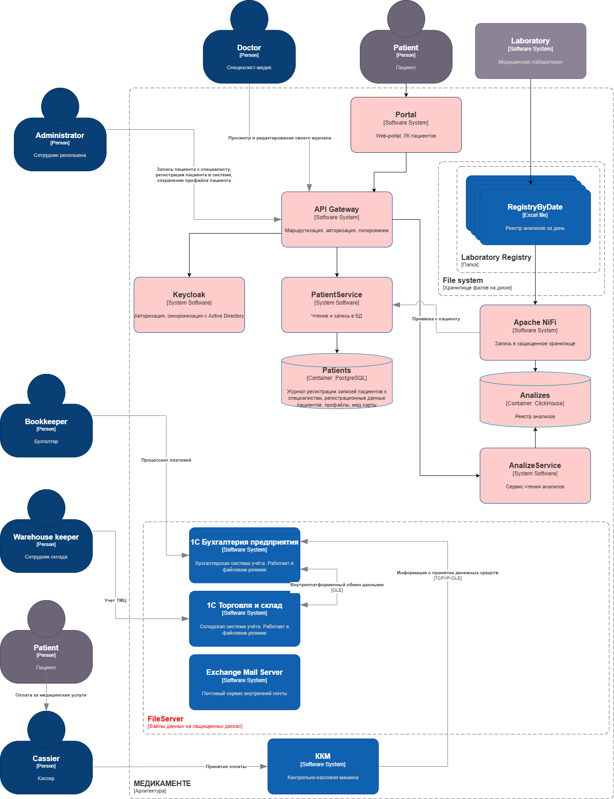

# Планы компании
 - открыть новые филиалы в этом году
 - автоматизировать работу - поддержать пятикратный рост объёма данных 
 - активно нанимать новых сотрудников
 - усилить безопасность медицинских карт, защитить от несанкционированного доступа и утечек
 - перейти на единую систему хранения и управления данными.
 - объединить журналы приёма пациентов, учёт пациентов и учёт оплаты услуг
 - создать мобильное приложение, в котором клиенты смогут самостоятельно записаться к врачу через личный кабинет (ЛК).

## Разработка новых систем и миграция

Чтобы автоматизировать процессы, компания планирует разработать:

 - Портал для клиентов.
 - Портал для сотрудников ресепшена.
 - Платёжный шлюз.
 - CRM для сбора данных о клиентах.
 - Интеграцию с лабораторией анализов.

## Промежуточное состояние - через пару месяцев

 - MVP, в котором клиент сможет самостоятельно записаться на приём к специалисту через портал компании. 
 - При этом команда ресепшена будет видеть эту запись: сотрудники смогут отследить запись в системе и за день до приёма напомнить про него и пациенту, и специалисту. 
 - Cотрудники смогут за день до приёма напомнить о приеме и пациенту, и специалисту. 
 - Необходимо определить категории данных пациентов и разнести их по различным доменам. 
   - Для каждой категории данных определить роли (RBAC) или атрибуты (ABAC), на основании которых сотрудникам будет разрешён доступ к данным.

# Технические решения ToBe

## Стратегия

* Внедрить механизмы протоколирования и контроля потока данных во внутренней сети.
* Внедрить шифрование данных при хранении и передачи
* Внедрить единую систему хранения и управления данными
* Реализовать соответствие принципам и требованиям законодательства РФ в области хранения и обработки данных

## Для MVP 

1. Перенести файлы "1С:Бухгалтерии предприятия", "1С: Торговля и склад" и "Exchange Mail Server" на защищенные диски 
2. Перенести реестры анализов, журналы регистрации, файлы со списками пациентов и их профайлами в защищенное хранилище данных на PosgreSQL(ключевая информация) и ClickHouse(неструктурированные данные)
3. Создать микросервис для чтения данных из хранилища п.2 и с возможностью записи к врачу
4. Создать микросервис(BFF) для сотрудника ресепшена (запись пациента на прием, регистрация клиента и его профайла)
5. Добавить API Gateway(Kong) между BFF п.4 и микросервиса из п.3 (через него в дальнейшем также будет работать BFF мобильного приложения)
6. Создать https-портал с ЛК пациента, бэкэнд портала связать с микросервисом п.3 через Kong п.5
7. Внедрить SSO на Keycloak (+ синхронизация с Active Directory), управление доступом:
   - RBAC
   - Двухфакторная аутентификация
   - Принцип "минимальных привилегий"

8. Полное логирование операций
9. TLS-шифрование передачи данных

## Блок комментариев для схемы

|Данные|Тип хранения данных|Период уничтожения конфиденциальных данных после обработки|Условия уничтожения конфиденциальных данных после обработки|Cпособы защиты при хранении|Cпособы защиты при передаче данных|
|:-|:-|:-|:-|:-|:-|
|Реестры анализов   |ClickHouse|В соответствии с законодательством|удаление Excel-файлов сразу после переноса в хранилище|Шифрование (AES-256)|TLS-шифрование|
|Журналы регистрации|PosgreSQL |В соответствии с законодательством||Шифрование (AES-256)|TLS-шифрование|
|Списки пациентов   |PosgreSQL |В соответствии с законодательством||Шифрование (AES-256)|TLS-шифрование|
|Профайлы пациентов |PosgreSQL |В соответствии с законодательством|По требованию клиента|Шифрование (AES-256)|TLS-шифрование|
|Запись на прием    |PosgreSQL |В соответствии с законодательством||Шифрование (AES-256)|TLS-шифрование|
|Графики приемов    |PosgreSQL |||||

