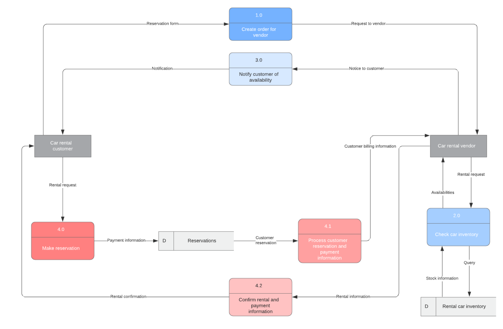
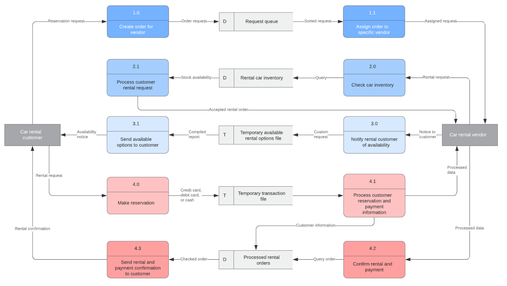
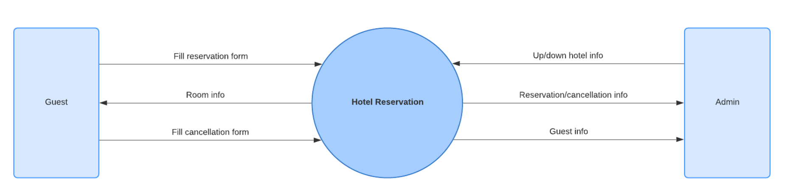
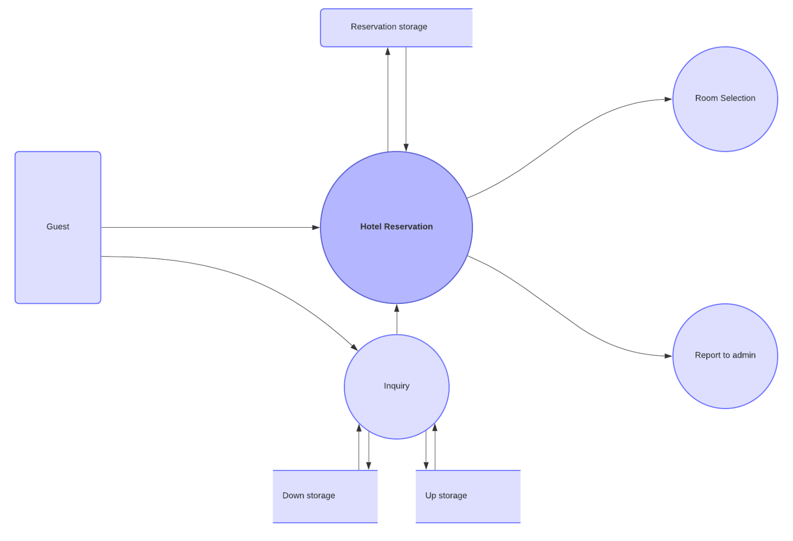
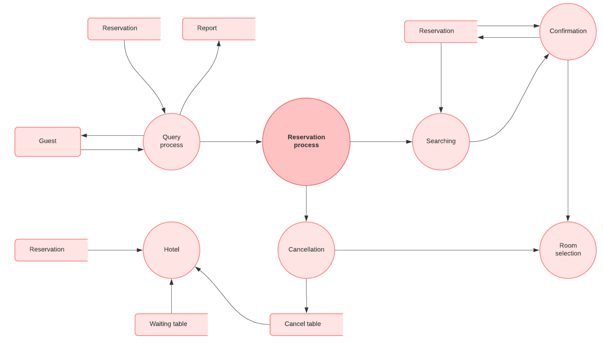
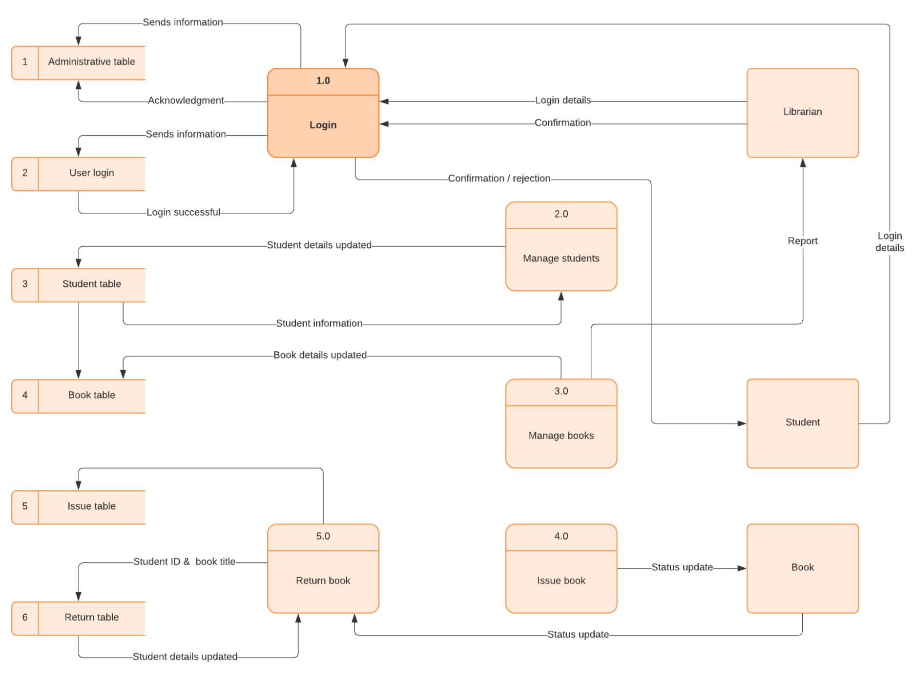

# Примеры диаграмм потоков данных, символы, типы и советы

Бизнес построен на системах и процессах — компания не могла бы работать без них. От методов воспитания лидеров до того, как команда взаимодействует с клиентами, почти все, что делает бизнес, включает в себя ту или иную систему. А когда дело доходит до систем и процессов, эффективность - это все. В некоторых случаях, сэкономив даже минуту или две, можно добиться существенной экономии времени. Существует бесчисленное множество способов анализа и повышения эффективности, но один из них выделяется - это диаграммы потоков данных. 

Диаграммы потоков данных (DFD) визуально отображают ваш процесс или систему, чтобы вы могли выявить возможности для повышения эффективности. Независимо от того, улучшаете ли вы существующий процесс или внедряете новый, схема потоков данных упростит задачу. Однако, если вы никогда раньше не создавали DFD, начало работы может оказаться пугающим. Нужно многое усвоить: различные уровни диаграмм, символов и обозначений, не говоря уже о самом создании диаграммы — навигация по всему этому займет больше времени, чем просмотр нескольких примеров. Если вы новичок в диаграммах потоков данных, это руководство поможет вам начать работу.

## Что такое диаграмма потоков данных?
Диаграмма потоков данных показывает, как информация проходит через процесс или систему. Он включает в себя ввод и вывод данных, хранилища данных и различные подпроцессы, через которые проходят данные. DFD создаются с использованием стандартизированных символов и обозначений для описания различных объектов и их взаимосвязей. 

Диаграммы потоков данных визуально представляют системы и процессы, которые было бы трудно описать просто словами. Вы можете использовать эти диаграммы, чтобы наметить существующую систему и улучшить ее или спланировать новую систему для внедрения. Визуализация каждого элемента упрощает выявление недостатков и создание наилучшей возможной системы. 

Прочитайте наш полный обзор диаграмм потоков данных, чтобы узнать больше о лучших практиках при создании DFD.

## Физические и логические диаграммы потоков данных

Прежде чем создавать диаграмму потоков данных, вам необходимо определить, какой DFD - физический или логический - лучше всего соответствует вашим потребностям. 
Если вы новичок в диаграммах потоков данных, не волнуйтесь — различие довольно простое.

**Диаграммы логических потоков** данных фокусируются на том, что происходит в конкретном информационном потоке: какая информация передается, какие объекты получают эту информацию, какие общие процессы происходят и т.д. Процессы, описанные в логическом DFD, являются бизнес-действиями — логический DFD не вникает в технические аспекты процесса или системы, например, в то, как этот процесс построен и реализован. Таким образом, вам не нужно включать такие детали, как конфигурация или технология хранения данных. Сотрудники, не занимающиеся техническими вопросами, должны уметь понимать эти диаграммы, что делает logical DFDs отличным инструментом для общения с заинтересованными сторонами проекта.

**Диаграммы физического потока** данных фокусируются на том, как все происходит в информационном потоке. На этих диаграммах указано программное обеспечение, аппаратное обеспечение, файлы и люди, участвующие в информационном потоке. Подробная физическая схема потока данных может облегчить разработку кода, необходимого для реализации системы передачи данных. 

Как физические, так и логические диаграммы потоков данных могут описывать один и тот же информационный поток. При координации они предоставляют больше деталей, чем любая из диаграмм по отдельности. Решая, какую использовать, имейте в виду, что вам могут понадобиться обе. 

Ознакомьтесь с этим [руководством по физическим и логическим DFDS](https://www.lucidchart.com/pages/data-flow-diagram/logical-vs-physical-data-flow-diagram) для получения дополнительной информации.

## Уровни диаграммы потоков данных
Диаграммы потоков данных также классифицируются по уровням. Начиная с самого базового, уровня 0, DFD становятся все более сложными по мере повышения уровня. При построении собственной диаграммы потоков данных вам нужно будет решить, какого уровня будет ваша диаграмма. 

**DFD уровня 0**, также известные как контекстные диаграммы, являются самыми [базовыми диаграммами потоков данных](https://www.lucidchart.com/pages/templates/data-flow-diagram-level-0). 
Они обеспечивают широкое представление, которое легко усваивается, но содержит мало деталей. Диаграммы потоков данных уровня 0 показывают отдельный узел процесса и его соединения с внешними объектами. Например, приведенный ниже пример иллюстрирует процесс бронирования отеля с обменом информацией между администратором и гостями. 

**DFD уровня 1** по-прежнему представляют собой общий обзор, но они содержат больше деталей, чем контекстная диаграмма. В DFD уровня 1 отдельный узел процесса на контекстной диаграмме разбит на подпроцессы. По мере добавления этих процессов диаграмме потребуются дополнительные потоки данных и хранилища данных, чтобы связать их вместе. В примере бронирования отеля это может включать добавление процессов выбора номера и запроса в систему бронирования, а также хранилища данных. 

**DFD уровня 2 +** просто разбивают процессы на более подробные подпроцессы. Теоретически DFD могут выходить за рамки уровня 3, но они редко это делают. Диаграммы потоков данных уровня 3 достаточно подробны, поэтому обычно не имеет смысла разбивать их подробнее. 

Приведенная ниже диаграмма уровня 2 расширяет информацию о процессе бронирования отеля, включая более детализированные процессы, такие как процессы отмены и подтверждения бронирования и последующие подключенные потоки данных.

## Символы и обозначения диаграммы потока данных
В зависимости от методологии (Гейн и Сарсон против Юордон и Коад) символы DFD немного различаются. Однако основные идеи остаются теми же. Диаграмма потоков данных состоит из четырех основных элементов: процессы, хранилища данных, внешние объекты и потоки данных. На рисунке ниже показаны стандартные формы для обеих методологий.

Если вы не уверены, как использовать каждый символ, прочитайте наше руководство по [символам DFD](https://www.lucidchart.com/pages/data-flow-diagram/data-flow-diagram-symbols).

## Как создать диаграмму потока данных.
Теперь, когда у вас есть некоторые базовые знания о диаграммах потоков данных и о том, как они распределяются по категориям, вы готовы создать свой собственный DFD. Процесс можно разбить на 5 шагов:

1. Определите основные входные и выходные данные в вашей системе. 

Почти каждый процесс или система начинается с ввода данных от внешнего объекта и заканчивается выводом данных в другой объект или базу данных. Идентификация таких входных и выходных данных дает общее представление о вашей системе — оно показывает самые широкие задачи, которые должна решать система. Остальная часть вашего DFD будет построена на этих элементах, поэтому крайне важно знать их на ранней стадии.

2. Постройте контекстную диаграмму

После того, как вы определили основные входы и выходы, построить контекстную диаграмму несложно. Нарисуйте единый узел процесса и подключите его к связанным внешним объектам. Этот узел представляет собой наиболее общий процесс, которому следует информация для перехода от ввода к выводу. 

Приведенный ниже пример потока диаграммы данных показывает, как информация передается между различными объектами через онлайн-сообщество. Данные поступают к внешним объектам и от них, представляя как входные, так и выходные данные. Центральный узел, ”онлайн-сообщество", является общим процессом. 

3. Разверните контекстную диаграмму до DFD уровня 1.

Отдельный узел процесса на вашей контекстной диаграмме не предоставляет много информации — вам нужно разбить его на подпроцессы. На диаграмме потока данных уровня 1 вы должны включить несколько узлов процесса, основные базы данных и все внешние объекты. Пройдите по потоку информации: где начинается информация и что с ней должно произойти перед каждым хранилищем данных?

4. Разверните до уровня 2 + DFD

Чтобы повысить детализацию вашей схемы потоков данных, выполните тот же процесс, что и на шаге 3. Процессы в вашем DFD 1-го уровня можно разбить на более конкретные подпроцессы. Еще раз убедитесь, что вы добавили все необходимые хранилища данных и потоки — на этом этапе у вас должна быть достаточно подробная разбивка вашей системы. Чтобы перейти к диаграмме потока данных уровня 2, просто повторите этот процесс. Остановитесь, как только достигнете удовлетворительного уровня детализации.

5. Подтвердите точность вашей окончательной диаграммы.

Когда ваша диаграмма будет полностью нарисована, пройдитесь по ней. Обратите пристальное внимание на поток информации: имеет ли это смысл? Включены ли все необходимые хранилища данных? Взглянув на вашу окончательную схему, другие стороны должны быть в состоянии понять, как функционирует ваша система. Прежде чем представить свою окончательную схему, проконсультируйтесь с коллегами, чтобы убедиться, что ваша схема понятна.

## Общий доступ к вашей схеме потоков данных

После завершения DFD следующим шагом будет общий доступ к ней. Вы создали его не только для того, чтобы сохранить при себе — будь то члены команды, ваш начальник или заинтересованные стороны, скорее всего, кто-то еще должен это увидеть. Если вы используете Lucidchart для создания диаграммы потока данных, в вашем распоряжении будет множество вариантов совместного использования. Диаграммы можно отправлять непосредственно в Lucidchart, предоставляя получателю доступ к документу Lucidchart. В зависимости от роли получателя вы можете предоставить ему разрешение на редактирование или отправку диаграммы только в режиме просмотра. Обширная интеграция Lucidchart позволяет обмениваться диаграммами на нескольких других платформах, включая Google Workspace и Slack. 